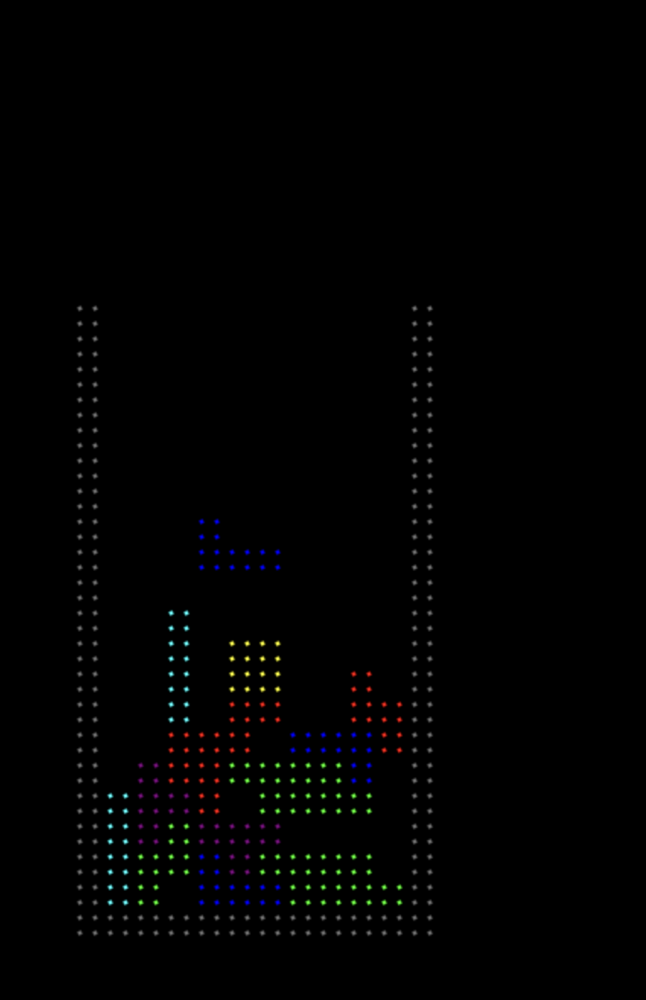

# Merlin Tetris

Tetris written in TypeScript, with rendering and inputs implemented in p5.js. `npm run build` concatenates and transpiles to a single Javascript file for pasting in to the [merlin sky](https://merlins.place/sky/) system running p5 in global mode. See my [main repo](https://github.com/fractal-bootcamp/briansmiley.Tetris) for the most up to date game code or play it on [my site](https://tetris.binarysmile.com).

    
    

